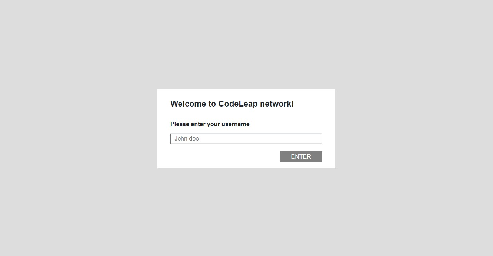
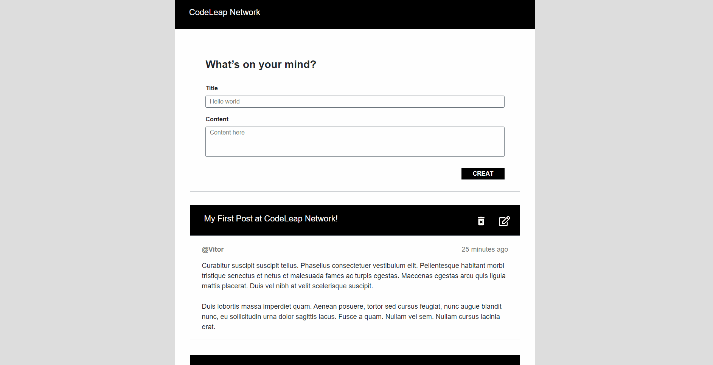

<h1>Social Network</h1>
<h2>Demo 📷</h2>

 
  
  

<h2>Description</h2>

This page was a test to get a job at <a href='https://codeleap.co.uk/'>CodeLeap</a>. So, I decided to let it as a repository because it was a expercience for me.

<h2>Features</h2>

After log in with your name, you can:

<ul style='font-size:17px'>
  <li>Check posts</li>
  <li>Create posts</li>
  <li>Edit posts</li>
  <li>Delete posts</li>
</ul>

<h2>Publication</h2>

Click here to check the result: http://code-leap-test.vercel.app

<h2>Frameworks and libraries:</h2>
<ul style='font-size:17px'>
  <li>
    <a href='https://reactjs.org/'>React</a>
  </li>
  <li>
    <a href='https://getbootstrap.com/'>Bootstrap</a> |
    <a href='https://reactstrap.github.io/?path=/story/home-installation--page'>Reactstrap</a>
  </li>
  <li>
    <a href='https://nextjs.org/'>Next.js</a>
  </li>
</ul>

 
<h3 align='center'>
  🚧 Project still missing some features, it will be implemented soon ⛏️ 🚧
</h3>
 

<footer>
  
🍊 Made by Davi Moreira | See my 
    <a href="https://www.linkedin.com/in/davi-moreira-dos-santos-804280203/">LinkedIn</a>
  

</footer>
